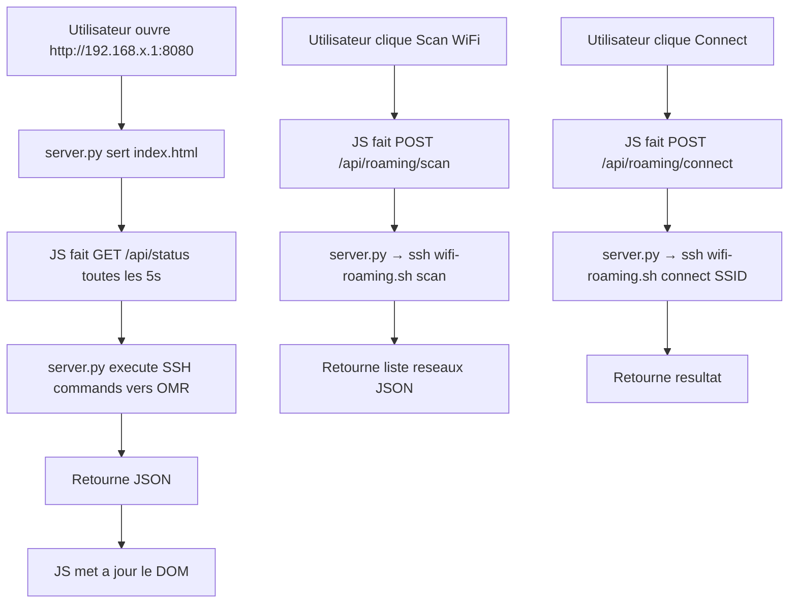
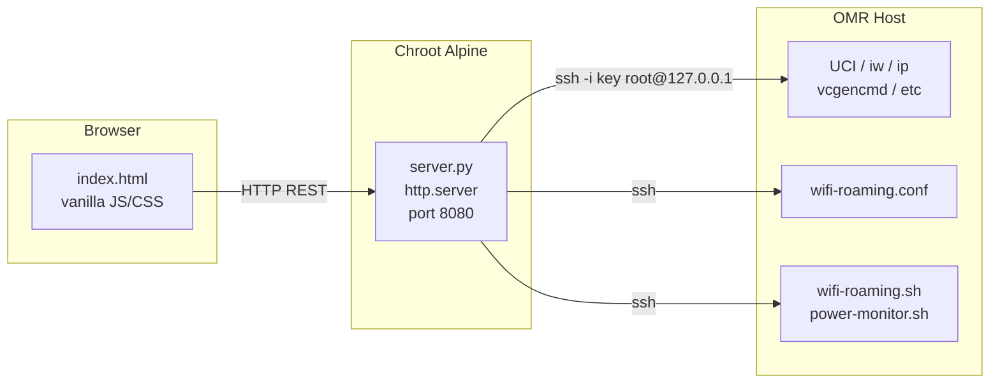

# Brainstorm : Dashboard Web pour seamless-wan

**Date** : 2026-03-05
**Demande originale** : "je voudrais implementer le site web selon les hypotheses precedentes"
**Type** : Evolution
**Statut** : Qualifie

---

## Resume

Implementation d'un dashboard web leger dans le chroot Alpine, accessible depuis n'importe quel appareil connecte au RPi (ethernet ou WiFi AP). Le dashboard expose l'etat du systeme (WANs, tunnel, temperature, power) et permet des actions de gestion (WiFi roaming, restart WAN, gestion SSID/passwords). Architecture : un backend Python (`http.server`, zero dependance) + un frontend vanilla HTML/CSS/JS mobile-first.

## Contexte Fonctionnel

### Modules concernes

| Module | Description | Impact |
|--------|-------------|--------|
| WiFi Roaming | Scan, connect, CRUD SSID | Principal |
| Power Monitor | Temperature, undervoltage, USB errors | Lecture seule |
| WAN Management | Etat des 4 WANs, restart | Actions |
| Tunnel | Etat Glorytun, latence | Lecture seule |
| noVNC / Captive Portal | Liens vers services existants | Liens |

### Ou dans l'application ?

```
Navigateur (smartphone/PC)
    |
    v
http://192.168.100.1:8080   (ethernet)
http://192.168.200.1:8080   (WiFi AP OMR-WiFi)
    |
    v
+------------------------------------------+
|  DASHBOARD WEB (chroot Alpine)           |
|  server.py (Python http.server)          |
|  Executes commands via SSH -> OMR host   |
+------------------------------------------+
    |
    v (ssh root@127.0.0.1 "cmd")
+------------------------------------------+
|  OMR HOST (OpenMPTCProuter)              |
|  UCI, iw, ip, vcgencmd, etc.            |
+------------------------------------------+
```

## Analyse de l'Evolution

### Evaluation

| Critere | Evaluation | Commentaire |
|---------|------------|-------------|
| Coherence projet | Oui | Prevu dans le README (`dashboard/` = TODO) |
| Valeur ajoutee | Haute | Monitoring + actions depuis n'importe quel appareil |
| Complexite | Moyenne | ~2 fichiers principaux + 1 init script |
| Risques | Faibles | Isole dans le chroot, pas d'impact sur OMR |

### Wireframe de la solution proposee

```
+--------------------------------------------------+
|  seamless-wan                    [auto-refresh]   |
+--------------------------------------------------+
|                                                   |
|  SYSTEM STATUS                                    |
|  +--------------------------------------------+  |
|  | Uptime: 3d 14h 22m    IP: 178.16.170.46    |  |
|  | CPU: 52C  | Throttle: OK  | Power: OK      |  |
|  +--------------------------------------------+  |
|                                                   |
|  WAN INTERFACES                                   |
|  +----------+ +----------+ +----------+ +------+  |
|  | wan1     | | wan2     | | wan3     | | wan4 |  |
|  | usb0     | | WiFi     | | usb1     | | roam |  |
|  | [UP]     | | [UP]     | | [DOWN]   | | [UP] |  |
|  | 10.x.x.x| | 10.x.x.x| |          | | SSID |  |
|  | [Restart]| | [Restart]| | [Restart]| |      |  |
|  +----------+ +----------+ +----------+ +------+  |
|                                                   |
|  TUNNEL                                           |
|  +--------------------------------------------+  |
|  | Glorytun: [UP]  Latency: 24ms               |  |
|  | Server: 10.255.255.1  Client: 10.255.255.2  |  |
|  +--------------------------------------------+  |
|                                                   |
|  WIFI ROAMING (wan4 - MT7601U)                    |
|  +--------------------------------------------+  |
|  | Status: Connected to Galaxy_S24 (-42dBm)    |  |
|  | [Scan] [Disconnect]                          |  |
|  |                                              |  |
|  | Available networks:                          |  |
|  |   -35dBm  FreeWifi_Secure                    |  |
|  |   -52dBm  Livebox-AB12        [Connect]      |  |
|  |   -67dBm  SNCF_WIFI                          |  |
|  |                                              |  |
|  | Known networks (wifi-roaming.conf):          |  |
|  |   [1] Galaxy_S24    ****  [Edit] [Del]       |  |
|  |   [5] CoffeeShop    open  [Edit] [Del]       |  |
|  |   [+Add Network]                              |  |
|  +--------------------------------------------+  |
|                                                   |
|  QUICK LINKS                                      |
|  [noVNC] [Captive Portal] [OMR LuCI]             |
|                                                   |
|  SERVICES                                         |
|  +--------------------------------------------+  |
|  | noVNC: [running]  WiFi-Roaming: [running]   |  |
|  | Power-Monitor: [running]                     |  |
|  | [Restart noVNC] [Restart WiFi-Roaming]       |  |
|  +--------------------------------------------+  |
+--------------------------------------------------+
```

### Workflow principal



### Architecture technique



### API REST prevue

| Methode | Endpoint | Description | Commande SSH |
|---------|----------|-------------|--------------|
| GET | `/api/status` | Etat global (WANs, tunnel, temp, power) | Multiples |
| GET | `/api/wan` | Detail des 4 WANs | `ip addr`, `uci show` |
| POST | `/api/wan/{id}/restart` | Restart un WAN | `ifdown/ifup` |
| GET | `/api/roaming/status` | Etat WiFi roaming | `wifi-roaming.sh status` |
| POST | `/api/roaming/scan` | Scanner les reseaux | `wifi-roaming.sh scan` |
| POST | `/api/roaming/connect` | Connecter a un SSID | `wifi-roaming.sh connect` |
| POST | `/api/roaming/disconnect` | Deconnecter | `wifi-roaming.sh disconnect` |
| GET | `/api/roaming/networks` | Lire wifi-roaming.conf | `cat /etc/wifi-roaming.conf` |
| POST | `/api/roaming/networks` | Ajouter un reseau | Ecrire dans conf |
| PUT | `/api/roaming/networks/{ssid}` | Modifier un reseau | Ecrire dans conf |
| DELETE | `/api/roaming/networks/{ssid}` | Supprimer un reseau | Ecrire dans conf |
| GET | `/api/tunnel` | Etat tunnel Glorytun | `ip link show tun0`, ping |
| GET | `/api/services` | Etat des services | `service X status` |
| POST | `/api/services/{name}/restart` | Restart un service | `service X restart` |

### Fichiers a creer

| Fichier | Description |
|---------|-------------|
| `dashboard/server.py` | Backend Python (http.server + API JSON) |
| `dashboard/static/index.html` | Frontend SPA (HTML/CSS/JS intregre) |
| `config/init.d/dashboard` | Script procd pour demarrage auto |
| `scripts/chroot/start-dashboard.sh` | Lanceur dans le chroot |
| `docs/dashboard.md` | Documentation d'installation |

### Fichiers existants reutilisables

| Fichier | Reutilisation |
|---------|---------------|
| `scripts/host/wifi-roaming.sh` | Commandes status/scan/connect/disconnect |
| `scripts/host/power-monitor.sh` | Logique de detection (vcgencmd, thermal) |
| `config/wifi-roaming.conf` | Format SSID|key|priority |
| `config/init.d/novnc` | Pattern procd a copier pour le dashboard |
| `scripts/host/alpine-enter.sh` | Pattern d'entree dans le chroot |

### Design frontend

- **Mobile-first** : cartes empilees verticalement, lisible sur smartphone
- **CSS moderne** : variables CSS, flexbox/grid, pas de framework
- **Couleurs** : vert=UP, rouge=DOWN, orange=WARNING
- **Auto-refresh** : polling `/api/status` toutes les 5s
- **Modales** : pour ajouter/editer un reseau WiFi
- **Dark mode** : optionnel via `prefers-color-scheme`

### Securite

| Risque | Mitigation |
|--------|------------|
| Acces non autorise | Dashboard accessible uniquement sur LAN/WiFi AP (pas expose sur WAN) |
| Injection de commande | Validation stricte des parametres cote serveur (SSID, etc.) |
| SSH key exposure | Cle SSH de `claude` user, read-only pour le serveur |
| CSRF | Pas critique car reseau local, mais token simple possible |

### Risques identifies

| Risque | Severite | Mitigation |
|--------|----------|------------|
| Commandes SSH lentes (>10s timeout) | Moyenne | Timeout configurable, feedback "loading" |
| wifi-roaming.sh scan bloque | Faible | Timeout 15s sur subprocess |
| OMR en read-only | Faible | `mount -o remount,rw /` avant ecriture conf |

## Conclusion

Evolution bien definie, coherente avec le README existant (le dossier `dashboard/` est deja prevu comme TODO). Complexite moyenne : ~500 lignes de Python + ~600 lignes de HTML/JS/CSS. Zero dependance externe (Python `http.server` + vanilla JS).

**Points de decision** :
1. Port 8080 OK ? (ou autre pour eviter conflit)
2. Authentification basique (login/password) ? Ou pas necessaire sur LAN prive ?
3. Priorite des fonctionnalites : tout d'un coup ou incrementalement ?

---

## Prochaine etape

-> Voulez-vous passer en mode Plan pour implementer cette demande ?

---
*Document genere le 2026-03-05 par `/ai-ask`*
