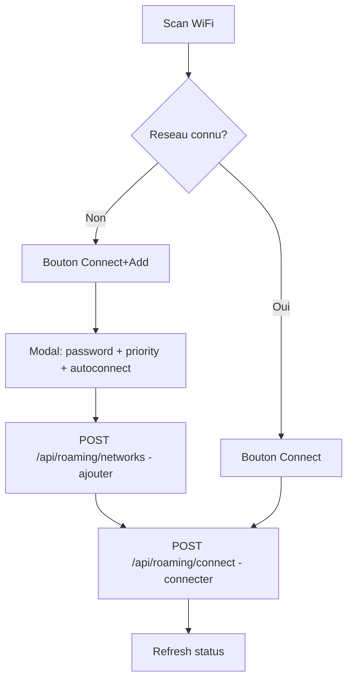
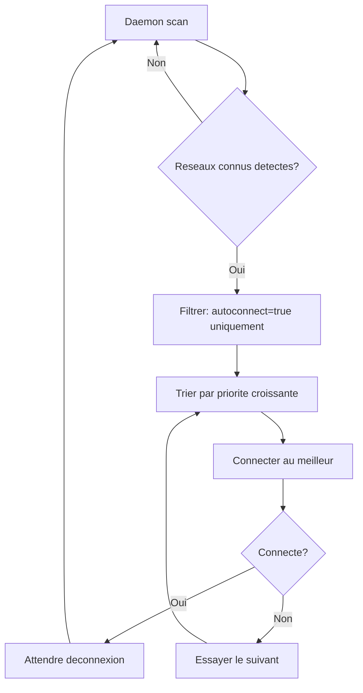

# Brainstorm : Connect from scan + auto-connect for known networks

**Date** : 2026-03-06
**Demande originale** : "pouvoir cliquer sur un reseau scanne, mettre le mot de passe, se connecter et l'ajouter aux reseaux connus. Definir lesquels se connectent automatiquement et dans quel ordre."
**Type** : Evolution
**Statut** : Qualifie

---

## Resume

Ameliorer le workflow WiFi roaming du dashboard pour permettre de se connecter a un reseau inconnu directement depuis les resultats de scan (avec saisie du mot de passe), et ajouter un mecanisme d'auto-connect base sur la priorite des reseaux connus.

## Contexte Fonctionnel

### Ou dans l'application ?

```
┌─────────────────────────────────────────────┐
│  seamless-wan                    [Logout]    │
├─────────────────────────────────────────────┤
│                                             │
│  WiFi Roaming (wan4 - MT7601U)              │
│  Status: Connected to ASTRAL0 (-41 dBm)     │
│  [Scan] [Disconnect]                        │
│                                             │
│  Available Networks                         │
│  ┌─────────────────────────────────────┐    │
│  │ ▓▓▓▓ ASTRAL0    -41 dBm (known)    │    │
│  │      [Connect]                      │    │
│  │ ▓▓▓  SFR_FB8F   -73 dBm            │    │
│  │      [Connect+Add]  ← NOUVEAU       │    │
│  │ ▓▓   Livebox    -59 dBm            │    │
│  │      [Connect+Add]  ← NOUVEAU       │    │
│  └─────────────────────────────────────┘    │
│                                             │
│  Known Networks                             │
│  ┌─────────────────────────────────────┐    │
│  │ 1  ASTRAL0  ****  auto  [Edit][Del]│    │
│  │ 2  DOOM     ****  auto  [Edit][Del]│    │
│  │ 10 Galaxy   ****  manual[Edit][Del]│ ← FLAG
│  └─────────────────────────────────────┘    │
│  [+ Add Network]                            │
│                                             │
└─────────────────────────────────────────────┘
```

### Modal connexion reseau inconnu

```
┌──────────────────────────────────┐
│  Connect to SFR_FB8F             │
│                                  │
│  Password                        │
│  [________________________]      │
│                                  │
│  Priority (1=best)               │
│  [10_____]                       │
│                                  │
│  [ ] Manual only (no autoconnect)│
│                                  │
│  [Cancel]            [Connect]   │
└──────────────────────────────────┘
```

## Analyse de l'Evolution

### Evaluation

| Critere | Evaluation | Commentaire |
|---------|------------|-------------|
| Valeur ajoutee | Haute | Workflow scan→connect en 2 clics |
| Complexite | Faible-Moyenne | Reutilise le modal existant + modif daemon |
| Risques | Faibles | Pas d'impact sur les fonctions existantes |

### Workflow propose





## Fichiers a modifier

| Fichier | Modification | Impact |
|---------|-------------|--------|
| `dashboard/static/dashboard.js` | Bouton "Connect+Add" sur reseaux inconnus, pre-remplir modal, checkbox autoconnect | Moyen |
| `dashboard/static/index.html` | Checkbox "manual only" dans le modal | Faible |
| `dashboard/host_commands.py` | Champ `autoconnect` dans KnownNetwork, parsing config | Faible |
| `dashboard/models.py` | Ajouter `autoconnect: bool` a KnownNetwork | Faible |
| `dashboard/server.py` | Passer `autoconnect` dans les endpoints CRUD | Faible |
| `scripts/host/wifi-roaming.sh` | Mode daemon: auto-connect aux reseaux marques auto | Moyen |
| `config/wifi-roaming.conf` | Format: `SSID\|key\|priority\|autoconnect` (retro-compatible) | Faible |

## Decisions de design

### Format wifi-roaming.conf

Actuel: `SSID|key|priority`
Nouveau: `SSID|key|priority|auto` (4e champ optionnel, defaut=`auto`)

- `auto` = autoconnect actif (defaut)
- `manual` = pas d'autoconnect

Retro-compatible: les lignes a 3 champs sont traitees comme `auto`.

### HTTPS

Reporte a plus tard. Le dashboard est sur le LAN local.

---
*Document genere le 2026-03-06 par `/ai-ask`*
