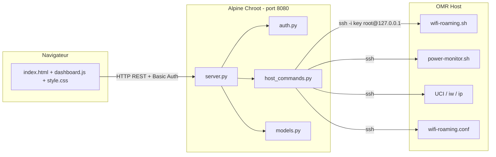
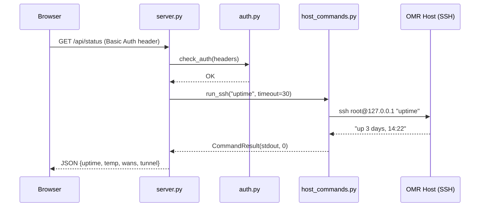

# PLAN : Web Dashboard seamless-wan

> Genere par `/ai-plan-interview` le 2026-03-05

## 1. Contexte et objectif

Implementer un dashboard web leger dans le chroot Alpine Linux du RPi 4, accessible depuis n'importe quel appareil connecte au routeur (LAN ethernet ou WiFi AP). Le dashboard permet le monitoring en temps reel (WANs, tunnel, temperature/power) et les actions de gestion (WiFi roaming, restart WAN/services, CRUD SSID/passwords).

**Stack** : Python `http.server` (zero dependance) + vanilla HTML/JS/CSS
**Communication** : SSH subprocess vers l'hote OMR (`ssh -i key root@127.0.0.1 "cmd"`)
**Acces** : http://192.168.100.1:8080 (ethernet) / http://192.168.200.1:8080 (WiFi AP)

## 2. Approche architecturale

**Approche choisie** : Pragmatique

4 fichiers Python bien separes + 3 fichiers frontend :

| Module | Responsabilite | ~LOC |
|--------|---------------|------|
| `server.py` | HTTP routing, auth middleware, response marshaling | 300 |
| `host_commands.py` | SSH execution, timeout, error handling, file locking | 180 |
| `models.py` | Dataclasses JSON-serializable pour les reponses API | 100 |
| `auth.py` | HTTP Basic Auth, session management | 80 |
| `static/index.html` | Structure HTML, layout responsive | 150 |
| `static/dashboard.js` | Fetch API, polling, DOM updates, modals | 300 |
| `static/style.css` | CSS Grid, dark mode, mobile-first | 250 |

**Alternatives rejetees** :
- Minimale (1 fichier) — impossible a maintenir, HTML melange au Python
- Clean Architecture (10+ fichiers) — over-engineering pour un dashboard RPi

## 2b. Visualisation

### Wireframe du dashboard

```
+--------------------------------------------------+
|  seamless-wan                    [auto-refresh]   |
+--------------------------------------------------+
|  LOGIN (si non authentifie)                       |
|  User: [________]  Pass: [________]  [Login]      |
+--------------------------------------------------+
|                                                   |
|  SYSTEM STATUS                                    |
|  +--------------------------------------------+  |
|  | Uptime: 3d 14h 22m    IP: 178.16.170.46    |  |
|  | CPU: 52C  | Throttle: OK  | Power: OK      |  |
|  +--------------------------------------------+  |
|                                                   |
|  WAN INTERFACES                                   |
|  +----------+ +----------+ +----------+ +------+  |
|  | wan1     | | wan2     | | wan3     | | wan4 |  |
|  | usb0     | | WiFi     | | usb1     | | roam |  |
|  | [UP]     | | [UP]     | | [DOWN]   | | [UP] |  |
|  | 10.x.x.x| | 10.x.x.x| |          | | SSID |  |
|  | [Restart]| | [Restart]| | [Restart]| |      |  |
|  +----------+ +----------+ +----------+ +------+  |
|                                                   |
|  TUNNEL                                           |
|  +--------------------------------------------+  |
|  | Glorytun: [UP]  Latency: 24ms               |  |
|  | Server: 10.255.255.1  Client: 10.255.255.2  |  |
|  +--------------------------------------------+  |
|                                                   |
|  WIFI ROAMING (wan4 - MT7601U)                    |
|  +--------------------------------------------+  |
|  | Status: Connected to Galaxy_S24 (-42dBm)    |  |
|  | [Scan] [Disconnect]                          |  |
|  |                                              |  |
|  | Available networks:                          |  |
|  |   ||||  FreeWifi_Secure      -35dBm          |  |
|  |   |||   Livebox-AB12         -52dBm [Connect]|  |
|  |   ||    SNCF_WIFI            -67dBm          |  |
|  |                                              |  |
|  | Known networks (wifi-roaming.conf):          |  |
|  |   [1] Galaxy_S24    ****  [Edit] [Del]       |  |
|  |   [5] CoffeeShop    open  [Edit] [Del]       |  |
|  |   [+ Add Network]                             |  |
|  +--------------------------------------------+  |
|                                                   |
|  QUICK LINKS                                      |
|  [noVNC] [Captive Portal] [OMR LuCI]             |
|                                                   |
|  SERVICES                                         |
|  +--------------------------------------------+  |
|  | noVNC: [running]  WiFi-Roaming: [running]   |  |
|  | Power-Monitor: [running]  Dashboard: [self]  |  |
|  | [Restart noVNC] [Restart WiFi-Roaming]       |  |
|  +--------------------------------------------+  |
+--------------------------------------------------+
```

### Modal "Add/Edit Network"

```
+----------------------------------+
|  Add Known Network         [X]   |
+----------------------------------+
|                                  |
|  SSID:     [________________________]  |
|  Password: [________________________]  |
|            [ ] Show password           |
|  Priority: [1-100] (lower=better)      |
|                                  |
|  [Cancel]           [Save]       |
+----------------------------------+
```

### Diagramme d'architecture



### Flux de requete type



## 3. Criteres d'acceptation

- [ ] Dashboard accessible sur http://192.168.x.1:8080 avec login/password
- [ ] Affiche l'etat des 4 WANs (interface, IP, up/down)
- [ ] Affiche l'etat du tunnel Glorytun (up/down, latence)
- [ ] Affiche temperature CPU, etat throttling, etat power monitor
- [ ] Affiche IP publique de sortie et uptime
- [ ] Permet scan WiFi sur wan4 (MT7601U) avec resultats tries par signal
- [ ] Permet connect/disconnect WiFi roaming
- [ ] Permet CRUD des reseaux connus (wifi-roaming.conf)
- [ ] Permet restart des WANs individuels
- [ ] Permet restart des services (noVNC, wifi-roaming, power-monitor)
- [ ] Auto-refresh status toutes les 5s
- [ ] Design mobile-first responsive
- [ ] Dark mode automatique (prefers-color-scheme)
- [ ] Toutes les operations SSH ont un timeout de 30s
- [ ] Messages d'erreur clairs pour l'utilisateur
- [ ] Validation des entrees (SSID, password) avant ecriture
- [ ] File locking sur wifi-roaming.conf

## 4. Analyse technique

### Fichiers a creer

| Fichier | Description |
|---------|-------------|
| `dashboard/server.py` | HTTP server + API routing + auth middleware |
| `dashboard/host_commands.py` | SSH execution wrapper avec timeout et error handling |
| `dashboard/models.py` | Dataclasses pour les reponses JSON |
| `dashboard/auth.py` | HTTP Basic Auth + gestion sessions |
| `dashboard/static/index.html` | Structure HTML du dashboard |
| `dashboard/static/dashboard.js` | Logique frontend (fetch, polling, DOM) |
| `dashboard/static/style.css` | Styles CSS (responsive, dark mode) |
| `config/init.d/dashboard` | Script procd pour demarrage automatique |
| `scripts/chroot/start-dashboard.sh` | Lanceur dans le chroot |
| `docs/dashboard.md` | Documentation d'installation et utilisation |

### Fichiers existants reutilises (non modifies)

| Fichier | Reutilisation |
|---------|---------------|
| `scripts/host/wifi-roaming.sh` | Via SSH: status, scan, connect, disconnect |
| `scripts/host/power-monitor.sh` | Logique monitoring (vcgencmd, thermal) |
| `config/wifi-roaming.conf` | CRUD via SSH (lecture + ecriture) |
| `config/init.d/novnc` | Pattern procd a copier |
| `scripts/chroot/start-novnc.sh` | Pattern lanceur chroot a copier |

### Migration DB
Non applicable (pas de base de donnees, fichiers seulement).

## 5. Plan d'implementation

### Etape 1 : Infrastructure backend

- [ ] 1.1 Creer `dashboard/models.py` — dataclasses (WANStatus, TunnelStatus, SystemStatus, WifiNetwork, CommandResult, ErrorResponse)
- [ ] 1.2 Creer `dashboard/auth.py` — HTTP Basic Auth :
  - Credentials definis en constantes dans auth.py (DEFAULT_USER / DEFAULT_PASS)
  - Overridable via variables d'environnement DASHBOARD_USER / DASHBOARD_PASS
  - Sessions in-memory (token cookie apres premier login)
  - Pas de persistence (reboot = re-login, acceptable)
- [ ] 1.3 Creer `dashboard/host_commands.py` — wrapper SSH avec :
  - Fonction `run_ssh(cmd, timeout=30)` retourne CommandResult
  - Detection filesystem read-only avant ecritures
  - File locking (flock) pour wifi-roaming.conf
  - Sanitization des arguments de commande (pas de shell=True)
  - Gestion des erreurs SSH (timeout, auth, connection refused)

### Etape 2 : API REST (server.py)

- [ ] 2.1 Creer `dashboard/server.py` avec BaseHTTPRequestHandler
- [ ] 2.2 Implementer le routing :

| Methode | Endpoint | Handler |
|---------|----------|---------|
| GET | `/` | Sert index.html |
| GET | `/static/*` | Sert fichiers statiques |
| GET | `/api/status` | Status global (WANs, tunnel, temp, IP, uptime) |
| GET | `/api/wan` | Detail des 4 WANs |
| POST | `/api/wan/<id>/restart` | ifdown + ifup wan |
| GET | `/api/roaming/status` | Etat WiFi roaming (daemon + connexion) |
| POST | `/api/roaming/scan` | Lance wifi-roaming.sh scan |
| POST | `/api/roaming/connect` | wifi-roaming.sh connect SSID |
| POST | `/api/roaming/disconnect` | wifi-roaming.sh disconnect |
| GET | `/api/roaming/networks` | Lit wifi-roaming.conf |
| POST | `/api/roaming/networks` | Ajoute un reseau |
| PUT | `/api/roaming/networks/<ssid>` | Modifie un reseau |
| DELETE | `/api/roaming/networks/<ssid>` | Supprime un reseau |
| GET | `/api/tunnel` | Etat tunnel Glorytun |
| GET | `/api/services` | Etat des services |
| POST | `/api/services/<name>/restart` | Restart service |

- [ ] 2.3 Implementer l'auth middleware (verifier credentials sur chaque requete /api/*)
- [ ] 2.4 Implementer la collecte du status global via SSH :

```python
# Commandes SSH pour /api/status
"uptime"                                    # Uptime
"cat /sys/class/thermal/thermal_zone0/temp" # Temperature (diviser par 1000)
"vcgencmd get_throttled"                    # Etat throttling
"ip addr show tun0"                         # Tunnel up/down + IP
"curl -s ifconfig.me"                       # IP publique
"ip addr show usb0"                         # wan1 IP
"ip addr show $(uci get network.wan2.device 2>/dev/null)" # wan2 IP
# etc. pour wan3, wan4
```

- [ ] 2.5 Implementer les commandes WiFi roaming via SSH :

```python
# Scan
"wifi-roaming.sh scan"     # Parse: signal\tSSID
# Connect
"wifi-roaming.sh connect {ssid}"  # ssid sanitize
# Disconnect
"wifi-roaming.sh disconnect"
# Status
"wifi-roaming.sh status"
```

- [ ] 2.6 Implementer le CRUD wifi-roaming.conf via SSH :

```python
# Read
"cat /etc/wifi-roaming.conf"
# Add (avec detection read-only FS)
"mount -o remount,rw / 2>/dev/null; echo '{ssid}|{key}|{priority}' >> /etc/wifi-roaming.conf"
# Delete
"mount -o remount,rw / 2>/dev/null; sed -i '/^{escaped_ssid}|/d' /etc/wifi-roaming.conf"
# Update
"mount -o remount,rw / 2>/dev/null; sed -i 's/^{old_ssid}|.*/{ssid}|{key}|{priority}/' /etc/wifi-roaming.conf"
```

### Etape 3 : Frontend

- [ ] 3.1 Creer `dashboard/static/style.css` :
  - Variables CSS pour theming (--bg, --text, --card, --accent, --success, --danger, --warning)
  - `@media (prefers-color-scheme: dark)` pour basculer les couleurs
  - CSS Grid pour le layout (colonnes adaptatives)
  - Cards avec border-radius, box-shadow
  - Mobile breakpoint a 768px (colonnes empilees)
  - Animations pour status indicators (pulse vert/rouge)
  - Modal overlay pour formulaires

- [ ] 3.2 Creer `dashboard/static/index.html` :
  - Header avec titre + indicateur auto-refresh
  - Section "System Status" (uptime, IP publique, temp, power)
  - Section "WAN Interfaces" (4 cards wan1-wan4)
  - Section "Tunnel" (Glorytun status)
  - Section "WiFi Roaming" (status, scan results, known networks)
  - Section "Quick Links" (noVNC, Captive Portal, LuCI)
  - Section "Services" (etat + boutons restart)
  - Modal "Add/Edit Network"
  - Login form (affiche si non authentifie)

- [ ] 3.3 Creer `dashboard/static/dashboard.js` :
  - `apiClient` : fetch wrapper avec auth header, timeout, error handling
  - `pollStatus()` : GET /api/status toutes les 5s, met a jour le DOM
  - `renderWanCards(data)` : genere les cards WAN avec indicateurs couleur
  - `renderRoaming(data)` : affiche status WiFi + liste reseaux connus
  - `doScan()` : POST /api/roaming/scan, affiche spinner pendant l'attente
  - `doConnect(ssid)` : POST /api/roaming/connect, avec confirmation
  - `doDisconnect()` : POST /api/roaming/disconnect
  - `showAddNetworkModal()` : modal avec formulaire SSID/password/priority
  - `saveNetwork(data)` : POST ou PUT /api/roaming/networks
  - `deleteNetwork(ssid)` : DELETE avec confirmation
  - `restartWan(id)` : POST /api/wan/id/restart
  - `restartService(name)` : POST /api/services/name/restart
  - Signal strength bars (dBm -> 1-4 bars visuelles)

### Etape 4 : Deploiement

- [ ] 4.1 Creer `scripts/chroot/start-dashboard.sh` :
  - Monte les filesystems necessaires (proc, sys si pas deja fait)
  - Lance `python3 /path/to/dashboard/server.py` en background
  - Redirige stdout/stderr vers /tmp/dashboard.log

- [ ] 4.2 Creer `config/init.d/dashboard` (procd) :
  - START=99 (apres novnc)
  - Utilise alpine-enter.sh pour entrer dans le chroot
  - procd_set_param respawn 3600 5 5
  - procd_set_param stdout 1 / stderr 1

- [ ] 4.3 Creer `docs/dashboard.md` :
  - Prerequis (chroot Alpine, Python 3, SSH key)
  - Installation etape par etape
  - Configuration (port, credentials)
  - Utilisation
  - Troubleshooting

## 6. Analyse des Gaps (Gap-Analyst)

### Edge Cases a gerer

| ID | Categorie | Description | Strategie | Priorite |
|----|-----------|-------------|-----------|----------|
| SSH-001 | ssh_failure | Timeout/erreur SSH non gere | Timeout 30s + messages clairs | Critique |
| SSH-002 | filesystem | OMR read-only apres power loss | Detection + `mount -o remount,rw /` | Haute |
| RACE-001 | concurrency | 2 connect simultanes corrompent UCI | Lock global operations WiFi | Haute |
| RACE-002 | concurrency | CRUD concurrent wifi-roaming.conf | flock() sur fichier | Haute |
| WIFI-CONF-001 | input_validation | SSID avec pipe casse le parsing | Validation caracteres speciaux | Haute |
| SCAN-001 | timeout | iw scan bloque 30-60s | Timeout subprocess + spinner UI | Haute |
| UCI-004 | input_validation | Password avec chars speciaux | Echappement avant uci set | Haute |
| SCAN-003 | parsing | Format iw scan varie par driver | Parsing robuste avec fallback | Moyenne |
| WIFI-CONF-004 | parsing | CRLF dans config | Strip \r au parsing | Moyenne |
| SCAN-004 | parsing | SSID caches (vides) dans scan | Filtrer SSID vides | Basse |

### Failure Modes couverts

| Composant | Failure | Handling prevu |
|-----------|---------|----------------|
| SSH | Timeout (host lent) | subprocess timeout=30s, erreur 504 au client |
| SSH | Cle invalide | Detection au demarrage, log erreur, message API |
| SSH | Host injoignable | ConnectionRefusedError -> erreur 503 |
| OMR FS | Read-only | `mount | grep 'rootfs.*ro'` avant ecritures |
| WiFi | Interface absente | get_phy_iface echec -> message "Interface non detectee" |
| Config | Fichier corrompu | Backup avant ecriture, validation au parse |
| Config | Concurrent write | flock() exclusif |

### Patterns reutilises du codebase

| Pattern | Source | Application |
|---------|--------|-------------|
| Dynamic interface detection | `wifi-roaming.sh:12-26` | Reutilise tel quel via SSH |
| Logger integration (syslog) | `wifi-roaming.sh:120` | Dashboard loggue aussi via logger |
| procd respawn | `config/init.d/novnc` | Copie du pattern pour init.d/dashboard |
| Chroot entry | `scripts/host/alpine-enter.sh` | Pattern pour start-dashboard.sh |

## 7. Analyse Code Field

### Hypotheses techniques

| Hypothese | Source |
|-----------|--------|
| Python 3 disponible dans le chroot Alpine | inference (websockify l'utilise deja) |
| SSH key de claude autorisee sur le host | gap-analyst (`/home/claude/.ssh/id_ed25519`) |
| Port 8080 libre dans le chroot | inference (noVNC=6080, LuCI=80/443) |
| subprocess.run disponible (Python 3.5+) | inference (Alpine edge = Python 3.12+) |
| wifi-roaming.sh accessible via /opt/wifi-roaming.sh | zero-coupure.md |

### Edge cases consolides

| Edge case | Source | Strategie |
|-----------|--------|-----------|
| SSH timeout pendant scan | gap-analyst (SCAN-001) | Timeout 30s + spinner |
| SSID avec `\|` dans le nom | gap-analyst (WIFI-CONF-001) | Rejeter ou echapper |
| Password avec quotes/espaces | gap-analyst (UCI-004) | Echapper pour UCI |
| OMR filesystem read-only | gap-analyst (SSH-002) | Remount rw automatique |
| 2 users cliquent Connect en meme temps | gap-analyst (RACE-001) | Lock threading |
| Config wifi corrompue | inference | Backup .bak avant ecriture |

### Limitations connues

- [ ] Pas de WebSocket — polling 5s (latence acceptable pour un dashboard)
- [ ] Pas de HTTPS — HTTP uniquement (LAN prive, acceptable)
- [ ] Sessions in-memory — reboot = deconnexion (acceptable)
- [ ] Pas de rate limiting — LAN prive avec peu d'utilisateurs
- [ ] Un seul couple login/password (pas multi-utilisateurs)

### Conditions de validite

- [ ] Python 3 installe et fonctionnel dans le chroot Alpine
- [ ] SSH key de claude autorisee pour root sur le host
- [ ] Port 8080 disponible
- [ ] wifi-roaming.sh et power-monitor.sh installes sur le host
- [ ] Partition chroot montee sur /mnt/data

## 8. Tests prevus

### Tests unitaires (dans le repo, sur PC)

- [ ] `test_models.py` — serialization JSON des dataclasses
- [ ] `test_auth.py` — verification credentials, sessions
- [ ] `test_host_commands.py` — mock subprocess, timeout, erreurs
- [ ] `test_config_parser.py` — parsing wifi-roaming.conf (edge cases: pipe, CRLF, vides)
- [ ] `test_input_validation.py` — SSID, password, priority

### Tests d'integration (sur RPi)

- [ ] SSH connectivity depuis le chroot
- [ ] Tous les endpoints API avec curl
- [ ] Scan WiFi reel
- [ ] Connect/disconnect WiFi
- [ ] CRUD wifi-roaming.conf

### Tests frontend (manuels)

- [ ] Responsive : desktop (1920px) + tablette (768px) + mobile (375px)
- [ ] Dark mode : prefers-color-scheme light et dark
- [ ] Auto-refresh : les données se mettent a jour toutes les 5s
- [ ] Modales : ajout/edition de reseau WiFi
- [ ] Gestion d'erreurs : messages visibles quand SSH timeout

## 9. Documentation a mettre a jour

- [ ] `docs/dashboard.md` (nouveau — installation et utilisation)
- [ ] `README.md` :
  - Changer `dashboard/              # Web dashboard (TODO)` en `dashboard/              # Web dashboard`
  - Ajouter les fichiers dashboard dans la structure du projet
  - Ajouter une section "Web Dashboard" dans Quick Start avec le lien http://192.168.x.1:8080

## 10. Estimation d'effort

| Composant | LOC | Effort |
|-----------|-----|--------|
| Backend (server.py + host_commands.py + models.py + auth.py) | ~660 | ~0.5j |
| Frontend (index.html + dashboard.js + style.css) | ~700 | ~0.5j |
| Tests unitaires (5 fichiers) | ~300 | ~0.25j |
| Deploiement (init.d + start script) | ~50 | ~0.1j |
| Documentation + README update | ~100 | ~0.1j |
| **Total** | **~1800** | **~1.5j** |

---

> **Prochaine etape** : `/ai-plan-check docs/planning/PLAN_WEB_DASHBOARD.md`
> Puis : `/ai-develop docs/planning/PLAN_WEB_DASHBOARD.md`
